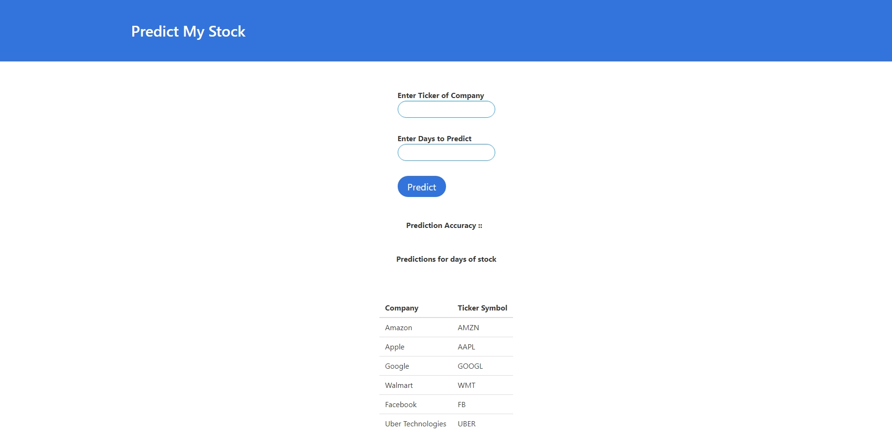

# PredictMyStock

 A Stock Market Prediction Web App in Django using Quandl API and Linear Regression. Using Quandl API, I fetched stock market values from the date since the company is IPO. The stock data is available till 27.03.2018. Then from input number of days 'n' we take that number of days data as our Prediction data and rest is training data and apply Linear Regression model. Suppose n=10, then data from 17.03.2018 to 27.03.2018 is our Prediction data and rest is training data. The accuracy most of the times is above 90%. 




### Dependencies
>python==3.7.4  
Django==2.2.5    
numpy==1.17.2   
pandas==0.25.1  
Quandl==3.4.8  
scikit-learn==0.21.3  
DateTime==4.3


### Steps to Execute 

#### 2. cd into PredictMyStock 
```bash
cd PredictMyStock
```
#### 3. Create virtual environment 
```bash
python -m venv virtualenv
```
#### 4. Activate virtual environment 
```bash
virtualenv\Scripts\activate
```
#### 5. Install dependencies
```bash
pip install requirements.txt
```
#### 6. Run PredictMyStock 
```bash
python manage.py runserver
```
Go to your browser at http://127.0.0.1:8000

Enter Stock Ticker Symbol and Days and hit Predict!


